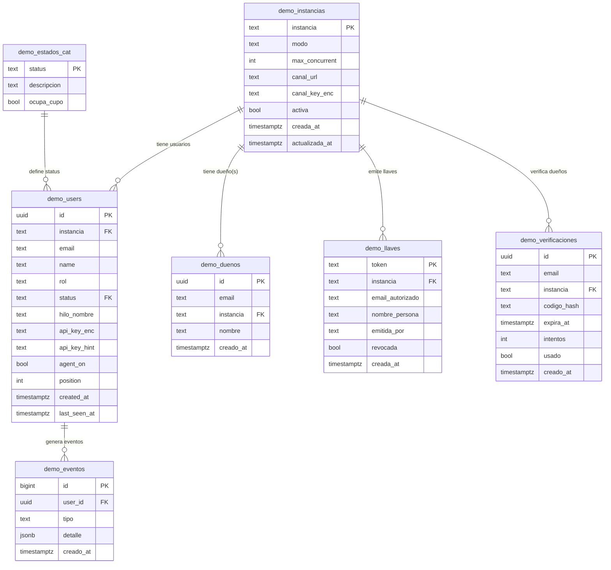

# 🏗️ REESTRUCTURACIÓN BD DEMO — Plan de Diseño F0 (aprobar ANTES de construir)

> **Origen (Brian, 2026-07-24):** la radiografía profunda reveló hallazgos CRÍTICOS — todo
> hardcodeado, tablas sin relacionar, config regada en 4+ lugares, funciones huérfanas, correo STUB.
> **"Vamos por un PRODUCTO, no un MVP pedorro. La BD es la base de la información; sin control,
> estamos mal."** Método de Fases "F": explicar→aprobar→construir.
>
> **Objetivo:** BD **conectada · escalable · confiable · segura**. Fuente única de verdad. Cero hardcodeo.
> **⛔ CERO código/DDL hasta que Brian apruebe este documento.**
> **Alcance de esta ronda:** SOLO la BD y Neon (los archivos/endpoints van en una ronda posterior).

---

## 1 · LOS HALLAZGOS QUE LO DISPARARON (evidencia real)

| # | Hallazgo | Gravedad | Evidencia |
|---|---|---|---|
| H1 | Tablas en uso SIN relaciones formales (FK). Solo el código las conecta | 🔴 | users/duenos/verificaciones sin FK entre sí |
| H2 | `kind` hardcodeado como CHECK → no escala sin tocar la BD | 🔴 | `CHECK (kind IN ('jazz','mashe','brian','general'))` |
| H3 | Las únicas FK viven en el diseño VIEJO vacío | 👻 | events→sessions→accounts (0 filas) |
| H4 | Estado `ready` definido pero no usado (5 def., código usa 4) | 🆕 | CHECK status incluye `ready` |
| H5 | Alta de dueños = SQL a mano; `registrarDueno()` huérfana | 🔴 | ninguna ruta la llama |
| H6 | Puente demo↔instancia (URL+key) en CÓDIGO + ENV, NADA en BD | 🔴 | `canalDeInstancia()`; `FOR3S_INST_*` |
| H7 | Config de 1 instancia regada en 4 lugares | 🔴 | síntesis H2+H5+H6 |
| H8 | Encender/apagar agente = NO-OP (env var muerta) | 🔴 | `container.ts` sin `DEMO_AGENT_CONTROL_URL` |
| H9 | `email.ts` es STUB → aviso de cupo NO se manda | 🔴 | `// STUB por ahora` |
| H10 | Dos caminos de correo (Resend real vs STUB) inconsistente | 🔴 | verificacion.ts real / email.ts stub |
| H11 | Token de GitHub NO se persiste (solo cookie) | 🔴 | githubOAuth.ts sin BD |
| H12 | `oauthGuard` toca BD, zona sin revisar | 🟡 | 2 ops BD |
| H13 | crypto/container dependen de MÁS env vars (config regada) | 🟡 | `DEMO_ENC_KEY`, etc. |

> H8–H13 son de la CAPA DE ARCHIVOS → se atacan en la ronda posterior. Esta ronda cierra H1–H7 (BD).

**Diagnóstico raíz:** NO existe una **fuente única de verdad** para "una instancia".

---

## 2 · LOS 4 PILARES DEL PRODUCTO (criterios que NO se rompen)

### 🔗 CONECTADA
- Relaciones formales (FK) entre TODAS las tablas. Integridad referencial real.
- No puede existir un usuario/llave/verificación de una instancia que no exista.
- `ON DELETE`/`ON UPDATE` definidos (qué pasa con los hijos si se borra un padre).

### 📈 ESCALABLE
- **Cero hardcodeo.** Agregar una instancia = 1 INSERT en `demo_instancias`. NADA de tocar código,
  ni CHECK, ni env vars, ni SQL manual.
- El `kind`/instancia deja de ser un CHECK fijo → pasa a ser FK a la tabla de instancias.
- Cupos, modos, URLs, keys: TODO configurable como dato, no como constante de código.

### 🛡️ CONFIABLE
- Un solo catálogo de estados (resolver H4: definir la lista canónica una vez).
- Constraints que impiden datos basura (UNIQUE, NOT NULL, CHECK de dominio donde aplique).
- Timestamps de auditoría (creado/actualizado) en todo.
- Migración reversible con respaldos antes de cada paso.

### 🔒 SEGURA
- Keys y secretos SIEMPRE cifrados en la BD (AES-256-GCM, ya existe en `crypto.ts`).
- La key de instancia (puente) cifrada, NO en env var plana.
- Datos de verificación hasheados (ya existe).
- Principio: la BD nunca guarda un secreto en claro.

---

## 3 · ESQUEMA NUEVO (el modelo de producto)

> Diagrama de relaciones. Todas las tablas cuelgan de `demo_instancias` (la fuente de verdad).



### 3.1 `demo_instancias` — ⭐ LA FUENTE DE VERDAD (nueva)
Reemplaza: el CHECK del `kind` (H2), las env vars del puente (H6), los cupos hardcodeados en código.
| Columna | Tipo | Rol |
|---|---|---|
| `instancia` | text PK | 'general','brian','jazz','mashe' + futuras SIN tocar código |
| `modo` | text | '1:1' \| '1:M' (lo decide el dueño) — CHECK de dominio |
| `max_concurrent` | int | cupo configurable (no hardcodeado). CHECK > 0 |
| `canal_url` | text | puente: URL del agente (ej. `/i/brian/v1/chat`) — EN BD |
| `canal_key_enc` | text | puente: key de la instancia CIFRADA — EN BD, no env |
| `activa` | bool | encendida/apagada |
| `creada_at`/`actualizada_at` | timestamptz | auditoría |

### 3.2 `demo_users` — personas (se REESTRUCTURA)
- `kind` (text suelto) → **`instancia` FK→demo_instancias** (H1 resuelto).
- `status` → **FK→demo_estados_cat** (H4 resuelto: catálogo único).
- Nuevo `rol`: 'dueno' \| 'visitante' \| 'invitado' (CHECK de dominio).
- Nuevo `hilo_nombre`: 'general' (dueño) \| 'hilo-<nombre>' (invitado).
- `UNIQUE (instancia, lower(email))` — una persona por instancia.
- BYOK: `api_key_enc`/`api_key_hint` (cifrado). Se completa en ronda de archivos.

### 3.3 `demo_duenos` — dueños (+FK, +id, +regla)
- `instancia` → FK→demo_instancias. Regla: **un dueño solo entra a SU oficina** (se valida en app + constraint).
- Alta desde panel (mata H5) — el endpoint/panel es ronda de archivos; la TABLA se deja lista aquí.

### 3.4 `demo_llaves` — llaves privadas 1:1 (nace de partir `demo_accounts`)
- Separa "oficinas" (van a `demo_instancias`) de "llaves 1:1" (van aquí).
- `revocada` bool → el dueño revoca cuando quiera. `emitida_por` = quién la dio.
- Regla: SOLO el dueño de la instancia crea/revoca llaves de SU instancia.

### 3.5 `demo_verificaciones` — códigos (+id, +FK)
- `instancia` → FK. Hash + expira + intentos + usado (seguridad ya existe, se conserva).

### 3.6 `demo_estados_cat` — ⭐ catálogo de estados (nueva, resuelve H4)
| status | descripcion | ocupa_cupo |
|---|---|---|
| connecting | recién entra, no confirmado | no |
| active | dentro, usando | **sí** |
| waiting | en cola (cupo lleno) | no |
| released | salió / expiró | no |
> Decisión: ¿se usa `ready`? Propuesta: **eliminarlo** (el código nunca lo usó). Confirmar con Brian.

### 3.7 `demo_eventos` — telemetría REAL (reemplaza `demo_events` fantasma)
- Conectada por FK a `demo_users`. `tipo` + `detalle` jsonb. Para VER qué pasa (auditoría/analítica).

---

## 3-BIS · SCHEMA SQL COMPLETO (el DDL de referencia para Neon · PostgreSQL 18)

> ⛔ NO EJECUTAR aún — es el schema de REFERENCIA para aprobar el diseño. La migración real (con
> respaldos + traspaso de datos) va en las fases F1..F6. `gen_random_uuid()` es nativo en PG13+.

```sql
-- ── 1) CATÁLOGO DE ESTADOS (resuelve H4: un lugar canónico; 'ready' eliminado) ──
CREATE TABLE demo_estados_cat (
    status       text PRIMARY KEY,
    descripcion  text        NOT NULL,
    ocupa_cupo   boolean     NOT NULL DEFAULT false
);
INSERT INTO demo_estados_cat (status, descripcion, ocupa_cupo) VALUES
    ('connecting', 'Recién entra, aún no confirmado',       false),
    ('active',     'Dentro, usando la demo',                 true),
    ('waiting',    'En cola porque el cupo está lleno',      false),
    ('released',   'Salió o su sesión expiró (libera cupo)', false);

-- ── 2) INSTANCIAS ⭐ FUENTE DE VERDAD (reemplaza CHECK del kind H2 + env FOR3S_INST_* H6 + cupos de código) ──
CREATE TABLE demo_instancias (
    instancia       text PRIMARY KEY,                        -- 'general','brian',... y futuras
    modo            text        NOT NULL DEFAULT '1:M' CHECK (modo IN ('1:1','1:M')),
    max_concurrent  integer     NOT NULL DEFAULT 1 CHECK (max_concurrent > 0),
    canal_url       text,                                     -- puente: URL del agente (EN BD)
    canal_key_enc   text,                                     -- puente: key de instancia CIFRADA
    activa          boolean     NOT NULL DEFAULT true,
    creada_at       timestamptz NOT NULL DEFAULT now(),
    actualizada_at  timestamptz NOT NULL DEFAULT now()
);
INSERT INTO demo_instancias (instancia, modo, max_concurrent) VALUES
    ('general','1:M',10), ('brian','1:1',1), ('jazz','1:1',1), ('mashe','1:1',1);

-- ── 3) DUEÑOS (un dueño = una oficina) ──
CREATE TABLE demo_duenos (
    id         uuid PRIMARY KEY DEFAULT gen_random_uuid(),
    email      text        NOT NULL,
    instancia  text        NOT NULL REFERENCES demo_instancias(instancia)
                              ON UPDATE CASCADE ON DELETE RESTRICT,
    nombre     text,
    creado_at  timestamptz NOT NULL DEFAULT now(),
    UNIQUE (email),        -- un correo es dueño de UNA oficina
    UNIQUE (instancia)     -- una oficina tiene UN dueño (quitar si se quieren co-dueños)
);
INSERT INTO demo_duenos (email, instancia, nombre) VALUES
    ('brian.lopezofficial@gmail.com','general','Brian (admin general)'),
    ('brayan002150@gmail.com',       'brian',  'Brian');
    -- jazz / mashe: pendiente definir dueño

-- ── 4) USUARIOS (personas). kind suelto → instancia FK; +rol +hilo_nombre +cookie_id ──
CREATE TABLE demo_users (
    id            uuid PRIMARY KEY DEFAULT gen_random_uuid(),
    instancia     text        NOT NULL REFERENCES demo_instancias(instancia)
                                 ON UPDATE CASCADE ON DELETE CASCADE,
    email         text        NOT NULL,
    name          text        NOT NULL,
    rol           text        NOT NULL DEFAULT 'visitante' CHECK (rol IN ('dueno','visitante','invitado')),
    status        text        NOT NULL DEFAULT 'connecting' REFERENCES demo_estados_cat(status) ON UPDATE CASCADE,
    hilo_nombre   text,                                       -- 'general' | 'hilo-<nombre>'
    cookie_id     text,                                       -- navegador (pestaña) vs persona (email)
    api_key_enc   text,                                       -- BYOK cifrada (ronda de archivos)
    api_key_hint  text,
    agent_on      boolean     NOT NULL DEFAULT true,
    position      integer,
    notified      boolean     NOT NULL DEFAULT false,
    created_at    timestamptz NOT NULL DEFAULT now(),
    last_seen_at  timestamptz NOT NULL DEFAULT now(),
    UNIQUE (instancia, email)                                 -- una persona por oficina
);
CREATE INDEX idx_users_instancia       ON demo_users (instancia);
CREATE INDEX idx_users_status          ON demo_users (status);
CREATE INDEX idx_users_instancia_email ON demo_users (instancia, lower(email));
CREATE INDEX idx_users_last_seen       ON demo_users (last_seen_at);

-- ── 5) LLAVES PRIVADAS 1:1 (sale de partir el viejo demo_accounts; el dueño crea/revoca) ──
CREATE TABLE demo_llaves (
    token             text PRIMARY KEY,                       -- link secreto p-...
    instancia         text        NOT NULL REFERENCES demo_instancias(instancia)
                                     ON UPDATE CASCADE ON DELETE CASCADE,
    email_autorizado  text        NOT NULL,
    nombre_persona    text,
    emitida_por       text,                                   -- el dueño que la dio
    revocada          boolean     NOT NULL DEFAULT false,     -- el dueño la apaga cuando quiera
    creada_at         timestamptz NOT NULL DEFAULT now()
);
CREATE INDEX idx_llaves_instancia ON demo_llaves (instancia);
CREATE INDEX idx_llaves_email     ON demo_llaves (lower(email_autorizado));

-- ── 6) VERIFICACIONES (códigos de dueño; hash+expira+intentos+usado, seguridad ya existente) ──
CREATE TABLE demo_verificaciones (
    id           uuid PRIMARY KEY DEFAULT gen_random_uuid(),
    email        text        NOT NULL,
    instancia    text        NOT NULL REFERENCES demo_instancias(instancia)
                                ON UPDATE CASCADE ON DELETE CASCADE,
    codigo_hash  text        NOT NULL,                        -- sha256(correo:codigo), nunca claro
    expira_at    timestamptz NOT NULL,
    intentos     integer     NOT NULL DEFAULT 0,
    usado        boolean     NOT NULL DEFAULT false,
    creado_at    timestamptz NOT NULL DEFAULT now(),
    UNIQUE (email)                                            -- un código pendiente por correo
);
CREATE INDEX idx_verif_expira ON demo_verificaciones (expira_at);

-- ── 7) EVENTOS (telemetría REAL conectada — reemplaza el demo_events fantasma) ──
CREATE TABLE demo_eventos (
    id         bigint GENERATED ALWAYS AS IDENTITY PRIMARY KEY,
    user_id    uuid        REFERENCES demo_users(id) ON DELETE SET NULL,
    instancia  text        REFERENCES demo_instancias(instancia) ON DELETE SET NULL,
    tipo       text        NOT NULL,                          -- 'join','leave','chat','verify',...
    detalle    jsonb       NOT NULL DEFAULT '{}'::jsonb,
    creado_at  timestamptz NOT NULL DEFAULT now()
);
CREATE INDEX idx_eventos_user   ON demo_eventos (user_id);
CREATE INDEX idx_eventos_tipo   ON demo_eventos (tipo);
CREATE INDEX idx_eventos_creado ON demo_eventos (creado_at);
```

**Relaciones (todo cuelga de `demo_instancias`):**
`duenos.instancia` · `users.instancia` · `llaves.instancia` · `verificaciones.instancia` ·
`eventos.instancia` → `demo_instancias`. `users.status` → `demo_estados_cat`. `eventos.user_id` → `demo_users`.
**Escalar = 1 INSERT en `demo_instancias`. Cero código.**

---

## 4 · HILOS (demo ↔ agente) — regla de oro (queda ligada, se implementa con archivos+agente)
- **Dueño** → hilo **`general`** de su agente (su memoria de siempre).
- **Invitado** → hilo **nuevo aislado** `hilo-<nombre>` (NO contagia el general).
- Dueño **ve y controla** los hilos de su oficina.
- La BD lo soporta con `demo_users.hilo_nombre`. La lógica del agente = [[project_pendiente_hilo_general_al_nacer]] (server-primero, ronda posterior).

---

## 5 · MIGRACIÓN (de lo viejo a lo nuevo SIN perder datos, reversible)
Cada paso: **respaldo antes → aplicar → verificar → siguiente**. Todo reversible.
1. Respaldo total (dump de las 6 tablas + confirmar los `_bak_` existentes).
2. Crear `demo_estados_cat` + sembrar los 4 estados.
3. Crear `demo_instancias` + sembrar las 4 actuales (general/brian/jazz/mashe) leyendo la config
   regada (cupos de código, URL del puente, key cifrada). general con su dueño.
4. Reestructurar `demo_users`: `kind`→`instancia` (FK), +`rol`, +`hilo_nombre`, `status`→FK. Migrar filas.
5. `demo_duenos`: +id, `instancia`→FK.
6. Partir `demo_accounts` → filas de oficina van a `demo_instancias`; filas 'privado' → `demo_llaves`.
7. `demo_verificaciones`: +id, `instancia`→FK.
8. Crear `demo_eventos`; decidir destino de `demo_sessions`/`demo_events`/`_bak_` (§7).
9. Quitar los CHECK hardcodeados de `kind`/`status` (ya reemplazados por FK).
10. Verificación final: FKs activas, cero hardcodeo, entrada/salida correctas, prueba E2E limpia.

---

## 6 · FASES DE CONSTRUCCIÓN (solo BD en esta ronda; tras aprobar diseño)
- **F1** · Catálogos base: `demo_estados_cat` + `demo_instancias` (fuente de verdad) + sembrado.
- **F2** · Puente a la BD: mover `canal_url`+`canal_key_enc` (cifrada) a `demo_instancias`. (El código
  que lo LEE se ajusta en la ronda de archivos; aquí queda el dato listo.)
- **F3** · Reestructurar `demo_users` (instancia FK + rol + hilo_nombre + status FK) + migrar filas.
- **F4** · `demo_duenos` + `demo_llaves` (partir accounts, revocación) + regla dueño-solo-su-oficina.
- **F5** · `demo_verificaciones` FK + `demo_eventos` telemetría + resolver fantasmas/backups.
- **F6** · Quitar CHECKs hardcodeados + verificación integral (FKs, constraints, cero hardcodeo).
> Cada fase: batería de verificación + evidencia en Neon antes de pasar a la siguiente. NO avanzar sin ✅.

---

## 7 · DECISIONES (cerradas por Brian 2026-07-24)
| # | Decisión | Resolución |
|---|---|---|
| D1 | Estado `ready` (H4) | ✅ **ELIMINARLO** (nunca se usó). Catálogo = connecting/active/waiting/released |
| D2 | `demo_sessions` (fantasma) | ✅ **RESCATAR la idea útil** (navegador cookie_id vs persona email) en tabla nueva limpia; eliminar la vieja vacía |
| D3 | `demo_events` (fantasma) | ✅ **Reemplazar** por `demo_eventos` conectada (FK a demo_users) |
| D4 | Backups `_bak_` | Conservar 1 ciclo, luego limpiar |
| D5 | Modo de `general` | ✅ **1:M** (muchos a la vez, cupo 10) CON dueño responsable |
| D6 | ¿general tiene dueño? | ✅ **SÍ** — dueño de general = **`brian.lopezofficial@gmail.com`** (admin específico de esa oficina), distinto del de brian (`brayan002150@gmail.com`). Mantiene "un dueño = una oficina" |

**Sembrado de dueños (estado objetivo en `demo_duenos`):**
| instancia | dueño (email) |
|---|---|
| general | `brian.lopezofficial@gmail.com` |
| brian | `brayan002150@gmail.com` |
| jazz | (pendiente definir) |
| mashe | (pendiente definir) |

**Consecuencia de D2:** el modelo separa **navegador** (cookie_id, "qué pestaña") de **persona**
(email, "quién es"). Útil para hilos y para saber si una persona tiene varias pestañas. Se refleja
como `demo_users.cookie_id` (o tabla de sesiones-por-navegador ligada) — se afina en F3.

---

## 8-PEND · PENDIENTES DE CABLEADO (código debe LEER de la BD — ronda de archivos)

> A medida que la BD se vuelve la fuente de verdad, el código sigue leyendo de env/hardcodeo.
> Cada fase deja el DATO en la BD; CABLEAR el código a leerlo va en la ronda de archivos.

- [ ] **PC-F2 · Puente:** `lib/demo/for3sChat.ts` (`canalDeInstancia`, `GENERAL_BASE/KEY`) aún LEE
  de env vars (`FOR3S_INST_*`, `FOR3S_GENERAL_*`) y arma la URL en código. Debe LEER
  `canal_url` + descifrar `canal_key_enc` desde `demo_instancias`. Hoy conviven (BD tiene la verdad,
  código usa env → nada se rompe). Cablear en ronda de archivos. Al cablear: quitar las env de Vercel.

- [ ] **PC-F3 · demo_users:** el código (`userStore.ts`, `registerOrResume`, `buildResult`) aún
  escribe/lee `kind`, no `instancia`/`rol`/`hilo_nombre`. Cablear a las columnas nuevas en la ronda
  de archivos. Hoy conviven (ambas pobladas). En F6 se quita la columna `kind` y sus CHECKs viejos
  (`demo_users_kind_check`, `demo_users_status_check` con el 'ready' fantasma).

- [ ] **PC-F4 · duenos/llaves:** (a) el código lee llaves del viejo `demo_accounts` (`accountStore.ts`,
  `esCorreoDePrivada`) → cablear a `demo_llaves` (respetando `revocada`). (b) La regla "dueño solo
  entra a SU oficina" tiene la BD lista (roles+duenos) pero falta el ENFORCEMENT en la app (bloquear
  que un dueño entre a otra instancia como visitante). (c) mashe sin dueño → definir. Ronda de archivos.

## 8 · PENDIENTES LIGADOS (capa de archivos — ronda posterior, NO esta)
- P-A: panel admin para alta de dueños (mata H5). · P-B: auditar/eliminar hardcodeo del puente en
  código (H6). · H8 agente on/off. · H9/H10 correo STUB→real. · H11 token GitHub a BD.
- Estándar **HTTP QUERY** (RFC 10008): clasificar endpoints lectura(QUERY/GET) vs escritura(POST/…);
  verificar soporte Next/Vercel. Da claridad de "qué entra/qué sale". (§7-ter del historial.)

## 9-CABLEADO · PLAN DE CABLEADO (Ronda 2 — conectar el CÓDIGO a la BD nueva)

> **Estado:** BD reestructurada (F1–F6 ✅). Ahora el CÓDIGO debe DEJAR de usar la estructura vieja
> (columna `kind`, env vars del puente, tabla `demo_accounts`, cupos hardcodeados) y USAR la nueva
> (`instancia` FK, `demo_instancias` con puente cifrado, `demo_llaves`, catálogo, `demo_eventos`).
>
> **Por qué:** hoy la BD nueva y perfecta convive con código que habla con la vieja. Es una casa
> nueva con la gente entrando por la puerta vieja. Cablear = redirigir el código a la puerta nueva.
> Mientras no se cablee, funciona por la convivencia (ambas columnas pobladas), pero NO usamos las
> ventajas nuevas (escalar, puente en BD, telemetría, revocación de llaves).

### Los 5 CABLES (qué recablear y por qué)

| Cable | Archivos | De (viejo) | A (nuevo) | Por qué |
|---|---|---|---|---|
| **C1 · Puente** | `for3sChat.ts` | env `FOR3S_INST_*`/`FOR3S_GENERAL_*` + URL armada en código (`canalDeInstancia`) | leer `canal_url` + descifrar `canal_key_enc` de `demo_instancias` | Sacar el puente de Vercel; escalar sin tocar código/env (H6). |
| **C2 · Instancia** | `userStore.ts`, `accountStore.ts` | columna `kind` | columna `instancia` (FK) + `rol` + `hilo_nombre` | Que el código escriba/lea la relación formal, no el texto suelto (H1). |
| **C3 · Cupos** | `types.ts` (`MAX_CONCURRENT`), `userStore.ts`, `store.ts` | constante hardcodeada en código | leer `max_concurrent` de `demo_instancias` | Cupo configurable por dato, no recompilar para cambiarlo (H2). |
| **C4 · Llaves 1:1** | `accountStore.ts` (`esCorreoDePrivada`), `store.ts`, `accounts.ts` | tabla `demo_accounts` (kind='privado') | tabla `demo_llaves` (respetando `revocada`) | Llaves limpias + revocación por el dueño (H7). |
| **C5 · Telemetría** | endpoints clave (register, chat, verify, logout) | (no se registra nada) | `INSERT` en `demo_eventos` | "Ver qué está pasando" — hoy la tabla existe pero nadie la llena. |

### ESTADO DEL CABLEADO (2026-07-24)
- ✅ **C1 Puente** · `for3sChat.ts` chat lee canal (url+key descifrada) de `demo_instancias` (`instancias.ts`, fallback env).
- ✅ **C2 Instancia** · `userStore.ts`+`accountStore.ts` doble-escritura kind+instancia+rol+hilo_nombre.
- ✅ **C3 Cupos** · `cupoDe()` lee `max_concurrent` de la BD (cache 10s, cupo en vivo probado).
- ✅ **C4 Llaves** · `accountStore.ts` lee/escribe `demo_llaves` (revocación probada).
- ✅ **C5 Telemetría** · `eventos.ts` + register/verify/chat registran en `demo_eventos` (no rompe flujo).
- ✅ **C6 parte 1** · lecturas `WHERE kind`→`WHERE instancia` en `userStore.ts` (kind=instancia validado).
- ⏳ **C6 parte 2 (PENDIENTE, tras probar en real):** borrar columna `kind`, tabla `demo_accounts`,
  env vars del puente en Vercel, y la línea `DELETE FROM demo_accounts WHERE kind='privado'` (userStore:301).
  También: cablear conectores/miskeys (GENERAL_BASE/KEY que quedaron en for3sChat.ts).

### 🔴 PENDIENTE SISTÉMICO — "la cookie kind ≠ la instancia real" (2026-07-25)
Patrón de bug hallado probando en real: varios endpoints usan `sess.kind` (el kind de la
COOKIE, que dice por dónde entró el usuario) para operar sobre su persona. Pero un DUEÑO
verificado vive en SU instancia (brian) aunque la cookie diga 'general' → el WHERE no encuentra
la fila y la operación se pierde en el vacío.
- ✅ Ya corregidos: `touch()` (sacaba al refrescar) · `saveApiKey()` (perdía la API key).
- ⏳ FALTA barrer (mismo patrón, aún sin síntoma reportado): `app/api/demo/general/profile`
  (updateName) · `agent` (setAgentState) · `logout` (endSession) · `markNotified` ·
  el `registrarEvento` del chat general usa `sess.kind` como instancia.
- Regla a aplicar: **ubicar a la persona por CORREO** (su instancia real manda), o resolver la
  instancia real una vez por request y pasarla. La cookie solo dice por dónde entró.

### Fases de cableado (una por cable, verificar antes de avanzar — igual que la BD)
- **CB1 · Puente (C1):** helper `instanciaCanal(instancia)` que lee de `demo_instancias` + descifra.
  `for3sChat.ts` lo usa en vez de env/URL-en-código. Fallback a env si la fila no tiene canal (transición).
- **CB2 · Instancia+rol (C2):** `userStore` escribe/lee `instancia`/`rol`/`hilo_nombre`. Doble-escritura
  temporal (kind + instancia) para no romper, luego dejar solo `instancia`.
- **CB3 · Cupos (C3):** `MAX_CONCURRENT`/`CONTAINER_NAME` dejan de ser constantes → se leen de la BD (cache corta).
- **CB4 · Llaves (C4):** `esCorreoDePrivada` y afines leen `demo_llaves` (WHERE revocada=false).
- **CB5 · Telemetría (C5):** registrar eventos (join/leave/chat/verify) en `demo_eventos`.
- **CB6 · Limpieza final:** quitar la columna `kind` de `demo_users`, retirar `demo_accounts` viejo,
  quitar las env vars del puente en Vercel. Solo cuando CB1–CB5 estén verificados.
- Cada fase: `bun run build` verde + prueba E2E en la demo real + evidencia en Neon.

### ❓ PREGUNTAS antes de arrancar el cableado (para no equivocar el rumbo)
1. **Orden:** ¿empezamos por C1 (Puente, el que más te importaba del hardcodeo) o por C2 (Instancia,
   la base de todo)? Recomiendo **C1** (aísla el hardcodeo del puente, valor visible rápido).
2. **Transición:** ¿doble-escritura temporal (kind + instancia a la vez) para cero riesgo, o corte
   limpio (solo instancia) asumiendo un momento de ajuste? Recomiendo **doble-escritura** (más seguro).
3. **Cupos por env:** ¿quieres poder cambiar el cupo de una instancia SIN redeploy (leyendo de BD en
   vivo)? Sí = C3 lee siempre de BD. Recomiendo **sí** (es el punto de "escalable, no MVP").

## 9 · REGLAS DE ESTA RONDA
- ⛔ NO construir hasta que Brian apruebe §2–§6. Cero hardcodeo, sin excepciones.
- Esta ronda = SOLO BD/Neon. Archivos/endpoints = ronda posterior.
- Sitio = repo ElBrAyAn1967/For3s. Lo del agente (hilos) = server-primero.
